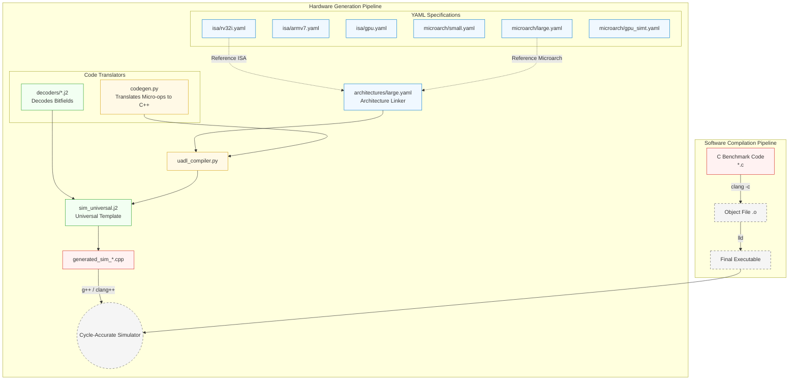
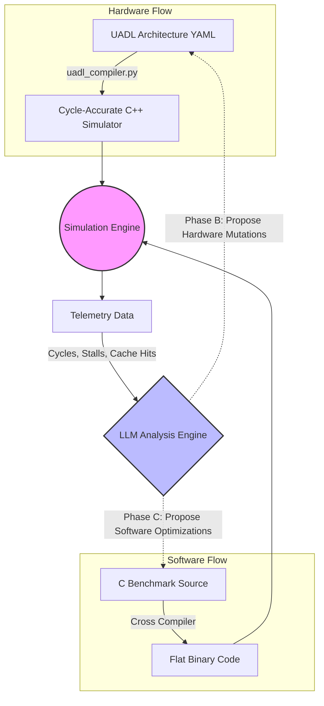

# UADL: Universal Architecture Description Language & LLM Co-Design

This document provides a comprehensive overview of the UADL project, including the toolchain architecture, core components, experimental workflows, and the integration of Large Language Models (LLMs) for hardware-software co-design.

---

## 1. How Our Toolchain Works

The UADL toolchain is designed to completely decouple architecture specification from simulator implementation. 

1. **Declarative Specification**: Hardware architects specify the Instruction Set Architecture (ISA), execution model (e.g., scalar CPU, SIMT GPU), pipeline stages, and memory hierarchy using human-readable **YAML** files.
2. **Dynamic Simulator Generation**: The `uadl_compiler.py` ingests these YAML definitions and uses Jinja2 templating (`sim_universal.j2`) to automatically generate a fast, cycle-accurate C++ simulator.
3. **Cross-Compilation**: C benchmark programs are compiled into flat binary executables using standard toolchains (like `riscv64-elf-gcc` or ARM equivalents) wrapped by our custom `c_compiler.py`.
4. **Execution & Profiling**: The generated C++ simulator executes the binary and outputs detailed telemetry, including total cycles, pipeline stalls, branch flushes, and cache hit/miss rates.

---

## 2. Core Components

The repository is structured into modular components:

*   **`src/isa/`**: Contains the fundamental instruction set definitions (e.g., `rv32i.yaml`, `armv7.yaml`, `gpu_isa.yaml`), including instruction encodings and behavior micro-ops.
*   **`src/experiments/architectures/`**: Contains micro-architectural configurations (e.g., `small.yaml`, `large.yaml`, `base.yaml`) defining specific pipeline depths, cache sizes, and memory topologies.
*   **`src/uadl_compiler.py`**: The core generator that stitches ISA and micro-architecture YAMLs together.
*   **`src/sim_universal.j2`**: The highly abstracted Jinja2 template that emits the final C++ simulator code.
*   **`src/codegen.py` & `src/decoders/`**: Auxiliary modules that translate YAML micro-ops (like `add`, `branch_eq`) into valid C++ code and auto-generate binary instruction decoders.
*   **`src/llm_search.py`**: The orchestrator for **Phase B**, managing the automated LLM architecture search loop.
*   **`src/experiments/run_experiment.py`**: The orchestrator for **Phase C**, managing the LLM-driven C code optimization loop.

---

## 3. Workflow Pipeline

The diagram below illustrates the end-to-end workflow, showing how both hardware (YAML) and software (C code) are ingested, simulated, and iteratively optimized by the LLM.

---

## 4. Experimental Phases

We have structured the project into three distinct phases to validate the flexibility of the UADL framework and its synergy with modern LLMs (Google Gemini 3.1).

### Phase A: Universal YAML Schema
*   **Goal**: Prove that a single, declarative YAML schema can express vastly different computing paradigms without hardcoded emulator logic.
*   **Status**: Complete. The same compiler and Jinja template successfully generate functioning simulators for a 5-stage pipelined RISC-V CPU, an ARMv7 processor, and a massively parallel SIMT GPU.

### Phase B: LLM Architecture Search
*   **Goal**: Utilize the Gemini API to perform automated Design Space Exploration (DSE).
*   **Mechanism**: The LLM analyzes the simulation telemetry (cycles, stalls) alongside a cost model (area/power budget). It iteratively mutates the underlying `architecture.yaml` (e.g., tweaking cache associativity, adjusting pipeline forwarding logic) to find the optimal hardware configuration for a given software workload.
*   **Results**: The LLM identified a non-obvious optimization by *disabling* data forwarding. While this increased cycle count slightly, it saved significant hardware area cost, resulting in a better overall UADL score.

### Phase C: LLM Code Optimization (UADL-Aware)
*   **Goal**: Demonstrate that LLMs can write fundamentally better code when they understand the target hardware architecture perfectly.
*   **Mechanism**: The Gemini API is provided with the C source code *and* the specific UADL YAML schema of the target machine. Instead of generic "-O3" style optimizations, the LLM applies hardware-specific rewrites (e.g., loop unrolling perfectly matched to the pipeline depth, or replacing multiplies with shift-adds for architectures lacking a hardware multiplier).
*   **Results**: The hardware-aware LLM drastically outperformed the naive LLM code generation, achieving massive speedups up to **64x** on tight mathematical kernels (like Fibonacci) by precisely tuning loop unrolls to the target machine's pipeline depth and branch penalty.

